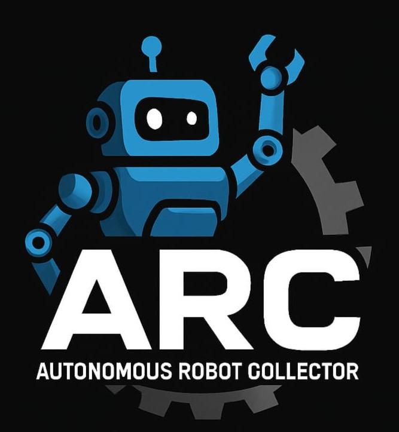

<h1 align="center">🤖 Team ARC – Pakistan | WRO 2025</h1>

<p align="center">
  
</p>

<p align="center">
  <a href="https://www.youtube.com/@TeamARC" target="_blank">🎥 YouTube</a> •
  <a href="https://instagram.com/teamarc" target="_blank">📸 Instagram</a> •
  <a href="https://teamarc.com" target="_blank">🌐 Website</a>
</p>

---

## 📋 Contents

- Mobility & Hardware Design  
- Power & Sensor Management  
- Wiring Diagram  
- Bill of Materials  
- Obstacle Navigation  
- Photos & Videos  
- Reproducibility Guide

---

## 👥 About Us


<p align="center">
  
</p>

**Team ARC** comprises Zowrays Hassan, Bilal Asif & Mauz Ahmed from Pakistan. We're competing in the **WRO Future Engineers 2025** category with a robot built using Arduino, PixyCam, motor drivers, servo mechanisms, 3D printed gears, and TOF sensors.

---

## 🏗️ Mobility & Hardware Design

Our robot features a custom 3D‑printed frame attached to a high‑torque DC motor with gearing and dual steering control via servo motors. A PixyCam provides object recognition and scene analysis.

---

## ⚡ Power & Sensor Management

- Power: 4S LiPo battery → Buck converter supplying separate rails (12 V for drive, 5 V for electronics)  
- Control: Arduino Nano for motion logic, PixyCam + Raspberry Pi (optional) for vision processing  
- Obstacle sensing: Time-of-Flight (ToF) sensors + differential vision via PixyCam

---

## 🔌 Wiring & Circuit Diagram

<p align="center">
  
</p>
- Power lines feed both motor driver (L298N or L293D) and logic controller
- Motors connected via PWM from Arduino Nano
- PixyCam integrated via I2C/SPi or UART
- ToF sensors along the front and sides

*(Placeholder imagery: examples above assemble power, motor, sensor routing for illustration purposes.)*

---

## 💰 Bill of Materials

| Qty | Component                             | Notes                   |
|-----|---------------------------------------|--------------------------|
| 1   | Arduino Nano                          | Main logic controller    |
| 1   | Arduino Omega or RPi (optional)       | For advanced vision      |
| 1   | PixyCam / TOF sensor                  | Object detection         |
| 1   | Servo motor (≥15kg·cm torque)         | Steering                 |
| 1   | DC motor (≥18kg·cm torque)            | Drive motor              |
| 1   | H‑Bridge (L298N or L293D)             | Motor driver             |
| –   | Gearing / wheels / 3D‑printing parts  | Frame, couplings         |
| –   | Jumpercables, nuts & screws           | Assembly hardware        |

---

## 🧩 Obstacle & Race Navigation

Our behavior tree handles:
- **STARTING → PD‑CENTER → TURNING‑L/R → DONE** states  
- Black-wall height detection using edge filters in OpenCV  
- Color-coded pillar detection via HSV segmentation with red/green mask wrapping  
- PD controller-based steering and distance tracking

---

## 📸 Photos & 📺 Videos

Gallery showing robot views: Front, Back, Side‑elevations, Component close‑ups.  
Embedded videos for “Opening Race” and “Obstacle Race” will be linked here.

---

## 🛠️ Reproducibility Guide

```bash
git clone https://github.com/ARC-autonomousroboticscollective/WRO_Arc_Pak.git
cd WRO_Arc_Pak

# Setup (Raspberry Pi example)
sudo apt update
sudo apt install python3-opencv python3-pyserial python3-picamera2

# Ensure correct Arduino port in config file
cd raspy
python3 roi.py
