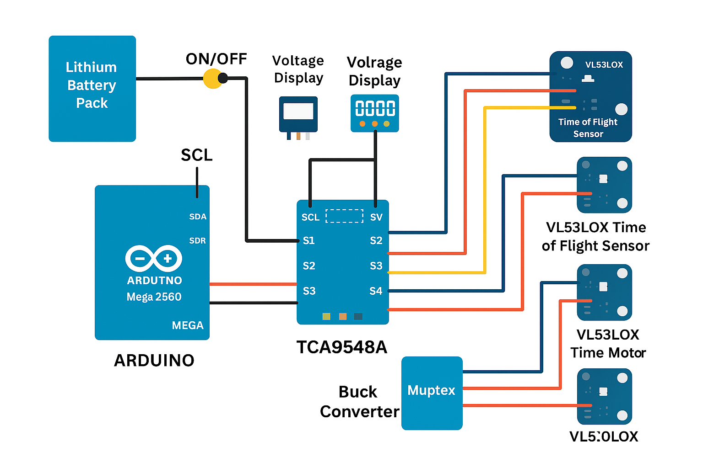

<h1 align="center">🤖 Team ARC – Pakistan | WRO Future Engineers 2025</h1>

<p align="center">
  
</p>

<p align="center">
  <a href="https://www.youtube.com/@TeamARC" target="_blank">🎥 YouTube</a> •
  <a href="https://www.instagram.com/team_arc_pk/" target="_blank">📸 Instagram</a> •
  <a href="https://teamarc.com" target="_blank">🌐 Website</a>
</p>

<p align="center">
  
  
  
  
</p>

---

## 📋 Contents
- [About Us](#-about-us)
- [Mobility & Hardware Design](#-mobility--hardware-design)
- [Power & Sensor Management](#-power--sensor-management)
- [Wiring & Pin Map](#-wiring--pin-map)
- [Circuit / CAD / Photos](#-circuit--cad--photos)
- [Bill of Materials (PKR)](#-bill-of-materials-pkr)
- [Control & Navigation](#-control--navigation)
- [Setup & Reproducibility](#-setup--reproducibility)
- [Testing & Calibration](#-testing--calibration)
- [Safety & Notes](#-safety--notes)
- [Project Structure](#-project-structure)
- [License](#-license)

---

## 👥 About Us

<p align="center">
  
</p>

**Team ARC** — **Zowrays Hassan, Bilal Asif, Mauz Ahmed** — representing Pakistan in **WRO Future Engineers 2025**.  
We’ve built a robust autonomous robot focused on obstacle navigation and **block (color) detection**.

---

## 🏗️ Mobility & Hardware Design

- **Drive:** High-torque DC motor with gearing (rear/center drive depending on chassis)
- **Steering:** Servo-based steering rack/linkage (≥15 kg·cm torque)
- **Motor Driver:** **L298N** H-Bridge for DC drive motor
- **Vision:** **PixyCam** for block/color detection
- **Proximity:** **3× Ultrasonic (HC-SR04)** — front-left, front-center, front-right
- **Frame:** Custom 3D-printed mounts for servo, sensors, battery & electronics
- **Wheels/Gearing:** Printed/laser-cut couplers and gear ratio tuned for track

---

## ⚡ Power & Sensor Management

**Battery:** 4S Li-Po (nominal 14.8 V)  
**Dedicated power rails via 3 buck converters** (noise isolation + reliability):

- **Buck #1 → Motor Rail** (e.g., 12 V for DC drive via L298N VIN)
- **Buck #2 → Servo Rail** (stable ~6 V; high-current capable ≥3 A)
- **Buck #3 → Logic Rail** (5 V to Arduino Nano, PixyCam, and sensors)

**Control Stack**
- **Arduino Nano** — motion, steering, distance fusion, state machine
- **PixyCam** — block detection (color signatures), UART/I2C to Arduino
- **Ultrasonics (3x HC-SR04)** — short-range obstacle detection & centering

> Rationale: Servos and DC motors generate noise/spikes. Isolating rails keeps logic and signals clean and prevents brownouts/reset.

---

## 🔌 Wiring & Pin Map

> Adjust pins as needed; these defaults work well on Arduino Nano.

| Subsystem | Component | Arduino Pins (Example) | Notes |
|---|---|---|---|
| **Drive** | L298N IN1/IN2 | D5 / D6 | Direction control |
|  | L298N ENA | D9 (PWM) | Speed (PWM) |
| **Steering** | Servo signal | D10 (PWM) | External 6 V rail (Buck #2). GND common. |
| **Ultrasonic** | Left (HC-SR04) | Trig D2, Echo D3 | Mount at ~15–20° outward |
|  | Center (HC-SR04) | Trig D4, Echo D7 | Straight ahead |
|  | Right (HC-SR04) | Trig D8, Echo D12 | Mount at ~15–20° outward |
| **PixyCam** | UART | RX D0 / TX D1 *(or SoftwareSerial on D11/D12)* | Alternatively I2C (A4/A5) |
| **Power** | Buck #1 | → L298N VIN (Motor Rail) | Ground tied to system GND |
|  | Buck #2 | → Servo + (6 V) | High-current line |
|  | Buck #3 | → 5 V Arduino + Sensors | Stable 5 V logic |

**Grounding:** All grounds (Battery −, Buck −, L298N GND, Servo −, Arduino GND, Sensor −) **must** be common.

---

## 🖼 Circuit / CAD / Photos

<p align="center">
  <br/>
  <em>System wiring (power isolation and signal routing)</em>
</p>

<p align="center">
  
  
  
</p>

### Component Images
<p align="center">
  
  
  
  
  
  
  
  
</p>

> **Tip:** Keep filenames as above or update the `` paths.

---

## 💰 Bill of Materials (PKR)

> Prices are **approximate Pakistan market** street prices and can vary by city/store & quality. Update with your actual invoices if needed.

| Qty | Component | Est. Unit (PKR) | Subtotal (PKR) | Notes |
|---:|---|---:|---:|---|
| 1 | Arduino Nano (original/clone) | 1,200 | 1,200 | Main controller |
| 1 | PixyCam (Pixy2) | 12,000 | 12,000 | Block/color detection |
| 3 | Ultrasonic Sensor (HC-SR04) | 300 | 900 | Left/Center/Right |
| 1 | High-Torque Servo (≥15 kg·cm) | 2,500 | 2,500 | Steering |
| 1 | DC Motor (≥18 kg·cm torque) | 3,000 | 3,000 | Drive |
| 1 | L298N Motor Driver | 700 | 700 | H-Bridge |
| 3 | Buck Converters (adjustable) | 500 | 1,500 | Motor / Servo / Logic |
| 1 | Li-Po Battery (4S, 1500–3000 mAh) | 6,000 | 6,000 | Main power |
| 1 | Li-Po Charger (balance) | 3,500 | 3,500 | Safety essential |
| – | 3D Printed Parts & Gears | 2,000 | 2,000 | PLA/PETG |
| – | Wheels, Hubs, Couplers | 1,500 | 1,500 | As per chassis |
| – | Wires, Screws, Heat-shrink | 800 | 800 | Misc |
| **—** | **Estimated Total** |  | **33,600** | (~USD 120)

---

## 🧠 Control & Navigation

**State Machine**
- `START → ALIGN → PD_CENTER → AVOID_TURN_L/R → BLOCK_DETECT → GOAL → DONE`

**Sensing & Fusion**
- **Ultrasonics (3x):** Robust short-range obstacle avoidance and corridor centering  
- **PixyCam:** Color signature tracking for block detection (supports multiple signatures)

**Control**
- **Drive speed:** PWM on L298N ENA (D9)  
- **Steering:** PD controller on servo (D10), proportional to lateral error  
- **Fail-safes:** Timeouts, min-distance clamp, soft-start on motor PWM

---

## 🔁 Setup & Reproducibility

```bash
# Clone
git clone https://github.com/ARC-autonomousroboticscollective/WRO_Arc_Pak.git
cd WRO_Arc_Pak
